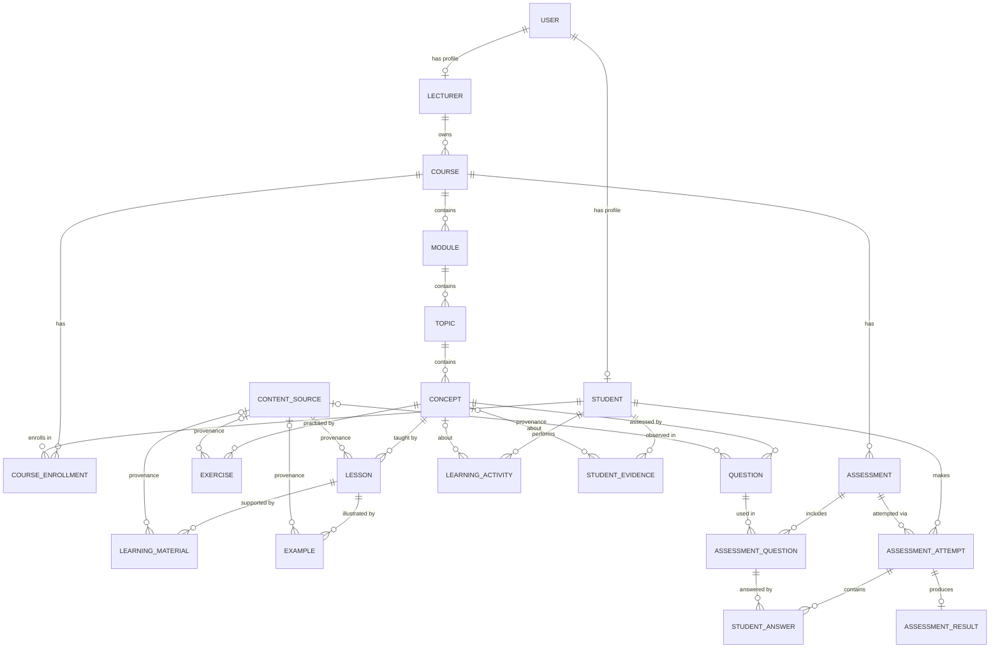

# SELVIA Learning Platform — PostgreSQL Domain Model

> **Status:** Design only. No database code, migrations, ORM schema, or connections exist yet.
> This document is the reference for the future PostgreSQL implementation.

---

## 1. Scope and Architecture Boundary

The SELVIA External Education & Assessment Platform uses two databases, plus an external consumer of its data:

| Store / Component | Responsibility |
|---|---|
| **PostgreSQL** (this document) | System of record for users, course structure, learning content, assessments, attempts, results, learning activities, and **observed student evidence**. |
| **Neo4j** (later) | Course Knowledge Graph: relationships *between* concepts (for example prerequisites and related concepts). |
| **Adaptive AI Tutor** (separate research component, via MCP) | Interprets student evidence to calculate competency, identify knowledge gaps, and make adaptive decisions. |

### 1.1 Explicitly excluded from PostgreSQL

The following belong to the Adaptive AI Tutor and **must not** be modelled as PostgreSQL entities in this platform:

- Competency
- Mastery
- Knowledge gap
- Adaptive decision
- Intervention decision

PostgreSQL stores **what was observed** (evidence). It never stores **what that evidence means** about a student's ability.

### 1.2 PostgreSQL ↔ Neo4j boundary

- PostgreSQL owns the content hierarchy `Course → Module → Topic → Concept` and every concept's identity (`concepts.id`).
- Neo4j will reference concepts by the same `concepts.id` UUID. Concept-to-concept relationships (prerequisite, related-to, part-of, etc.) live **only** in Neo4j.
- PostgreSQL does not contain concept-to-concept relationship tables.
- Neo4j also holds a copy of the `Course → Module → Topic → Concept → Lesson` hierarchy, keyed by the same PostgreSQL ids; PostgreSQL remains its source. See `knowledge-graph-design.md`.

### 1.3 PostgreSQL ↔ Adaptive AI Tutor boundary

- The Tutor reads `StudentEvidence` (and supporting context such as concepts and questions) through the platform's MCP integration.
- The Tutor's computed outputs are stored in the Tutor's own data stores, not in this database.

---

## 2. Global Conventions

### 2.1 Naming

- Entity names in this document use `PascalCase` (for example `StudentEvidence`).
- Physical table names use plural `snake_case` (for example `student_evidence`, `assessment_attempts`).
- Columns use `snake_case`. Foreign keys are named `<referenced_entity>_id`.

### 2.2 Primary keys

- Every entity uses a `uuid` primary key named `id`, generated by PostgreSQL with `gen_random_uuid()`.
- UUIDs avoid exposing record counts, are safe to generate on any service, and allow the same identifier to be shared with Neo4j and the Adaptive AI Tutor.

### 2.3 Timestamps

- All timestamps use `timestamptz` and are stored in UTC.
- Mutable entities have `created_at` and `updated_at` (`NOT NULL DEFAULT now()`).
- Append-only entities (`LearningActivity`, `StudentEvidence`) have `created_at` plus a domain timestamp describing when the behaviour happened (`occurred_at` / `observed_at`). They have no `updated_at`.

### 2.4 Deletion policy

- Content and assessments are **archived** (`status = 'ARCHIVED'`), never hard-deleted once students may have interacted with them.
- Users are deactivated (`is_active = false`), not deleted.
- Foreign keys default to `ON DELETE RESTRICT`. `ON DELETE CASCADE` is used only for strictly owned child rows where noted.
- `StudentEvidence`, `LearningActivity`, `AssessmentAttempt`, `StudentAnswer`, and `AssessmentResult` are never removed by cascades.

### 2.5 Content lifecycle

Content-bearing entities share a lifecycle status (`content_status` enum):

| Status | Meaning |
|---|---|
| `DRAFT` | Being authored; visible only to authors/lecturers. |
| `UNDER_REVIEW` | Submitted for review; not editable by the author until returned. |
| `APPROVED` | Reviewed and accepted; ready to publish. Can be used to build assessments. |
| `PUBLISHED` | Visible to enrolled students. |
| `ARCHIVED` | Retired; hidden from students but kept for history, attempts, and evidence. |

Typical transitions: `DRAFT → UNDER_REVIEW → APPROVED → PUBLISHED → ARCHIVED`, with `UNDER_REVIEW → DRAFT` when changes are requested.

**Visibility rule:** an item is visible to students only if the item **and all of its ancestors** (concept, topic, module, course) are `PUBLISHED`.

### 2.6 Content lifecycle & provenance fields

The following shared column group, referred to below as **[Lifecycle & provenance fields]**, is applied to `LearningMaterial`, `Lesson`, `Example`, `Exercise`, and `Question`:

| Field | Type | Notes |
|---|---|---|
| `status` | `content_status` | `NOT NULL DEFAULT 'DRAFT'` |
| `source_id` | `uuid` | FK → `content_sources.id`, nullable. Where the content came from. |
| `source_reference` | `text` | Nullable. Location within the source (page, chapter, section, URL fragment). |
| `created_by_user_id` | `uuid` | FK → `users.id`, `NOT NULL`. Author. |
| `reviewed_by_user_id` | `uuid` | FK → `users.id`, nullable. Reviewer who approved the content. |
| `reviewed_at` | `timestamptz` | Nullable. |
| `published_at` | `timestamptz` | Nullable. Set when first published. |

Shared constraints:

- `status IN ('APPROVED', 'PUBLISHED')` ⇒ `reviewed_by_user_id IS NOT NULL AND reviewed_at IS NOT NULL`.
- `status = 'PUBLISHED'` ⇒ `published_at IS NOT NULL`.
- Content whose source has `source_type = 'AI_GENERATED'` must pass through `UNDER_REVIEW` before it can be `APPROVED` (application rule).

### 2.7 Missing evidence principle

This principle applies throughout the model and is critical for the Adaptive AI Tutor:

1. **Absence of evidence is not evidence of failure.** If no `StudentEvidence` row exists for a student and concept, the state is *unknown / not observed* — never zero performance.
2. **`NULL` means "not measured"; `0` means "measured as zero".** Measurement columns (`score`, `max_score`, `percentage`, `time_spent_seconds`, `hints_used`, `errors_count`) are nullable and have **no default of `0`**.
3. Aggregations must ignore `NULL` values, never coalesce them to `0`.
4. A question that was presented but not answered is recorded with `status = 'SKIPPED'` and `score = NULL`. How to interpret a skip is the Tutor's decision.
5. Academic grading is separate from evidence: an `AssessmentResult` may award 0 marks for an unanswered question according to assessment rules, but the corresponding evidence remains `SKIPPED` with a `NULL` score.

---

## 3. Entity Relationship Overview

### 3.1 Hierarchy

```
User
 ├── Student
 │    ├── CourseEnrollment ──► Course
 │    ├── AssessmentAttempt ──► Assessment
 │    │    ├── StudentAnswer ──► AssessmentQuestion
 │    │    └── AssessmentResult
 │    ├── LearningActivity
 │    └── StudentEvidence ──► Concept
 └── Lecturer
      └── Course (owner)

Course
 ├── CourseEnrollment
 ├── Module
 │    └── Topic
 │         └── Concept
 │              ├── Lesson
 │              │    ├── LearningMaterial
 │              │    └── Example
 │              ├── Exercise
 │              └── Question
 └── Assessment (Quiz | Test | Examination)
      └── AssessmentQuestion ──► Question

ContentSource
 └── provenance for Lesson, LearningMaterial, Example, Exercise, Question
```

### 3.2 ER diagram



---

## 4. Enumerations

| Enum | Values |
|---|---|
| `user_role` | `STUDENT`, `LECTURER`, `ADMIN` |
| `content_status` | `DRAFT`, `UNDER_REVIEW`, `APPROVED`, `PUBLISHED`, `ARCHIVED` |
| `enrollment_status` | `ACTIVE`, `COMPLETED`, `DROPPED` |
| `content_source_type` | `LECTURER_AUTHORED`, `TEXTBOOK`, `ACADEMIC_PAPER`, `WEBSITE`, `OPEN_EDUCATIONAL_RESOURCE`, `PAST_PAPER`, `AI_GENERATED`, `IMPORTED` |
| `material_type` | `DOCUMENT`, `SLIDES`, `VIDEO`, `AUDIO`, `LINK`, `READING`, `OTHER` |
| `example_type` | `WORKED_EXAMPLE`, `CODE_EXAMPLE`, `CASE_STUDY`, `DIAGRAM`, `COUNTER_EXAMPLE` |
| `exercise_type` | `CODING`, `SHORT_ANSWER`, `PROBLEM_SOLVING`, `DIAGRAM`, `MULTI_STEP` |
| `question_type` | `MULTIPLE_CHOICE_SINGLE`, `MULTIPLE_CHOICE_MULTIPLE`, `TRUE_FALSE`, `SHORT_ANSWER`, `FILL_IN_THE_BLANK`, `MATCHING`, `ORDERING`, `ESSAY`, `CODE` |
| `difficulty_level` | `EASY`, `MEDIUM`, `HARD` |
| `bloom_level` | `REMEMBER`, `UNDERSTAND`, `APPLY`, `ANALYZE`, `EVALUATE`, `CREATE` (revised Bloom's taxonomy) |
| `assessment_type` | `QUIZ`, `TEST`, `EXAMINATION` |
| `results_release_policy` | `IMMEDIATE`, `AFTER_DEADLINE`, `MANUAL` |
| `attempt_status` | `IN_PROGRESS`, `SUBMITTED`, `AUTO_SUBMITTED`, `GRADED` |
| `grading_status` | `PENDING`, `AUTO_GRADED`, `MANUALLY_GRADED` |
| `result_status` | `PROVISIONAL`, `FINAL` |
| `activity_type` | `LESSON_VIEWED`, `LESSON_COMPLETED`, `MATERIAL_VIEWED`, `MATERIAL_DOWNLOADED`, `EXAMPLE_VIEWED`, `EXERCISE_STARTED`, `EXERCISE_HINT_REQUESTED`, `EXERCISE_SUBMITTED`, `ASSESSMENT_STARTED`, `ASSESSMENT_SUBMITTED` |
| `activity_target_type` | `LESSON`, `LEARNING_MATERIAL`, `EXAMPLE`, `EXERCISE`, `ASSESSMENT`, `QUESTION` |
| `evidence_source_type` | `ASSESSMENT_ANSWER`, `EXERCISE_SUBMISSION`, `LEARNING_ACTIVITY` |
| `evidence_status` | `COMPLETED`, `SKIPPED`, `ABANDONED`, `TIMED_OUT` |

---

## 5. Entities

### 5.1 User

**Purpose:** Authentication identity and account record for every person using the platform. Role-specific details live in `Student` and `Lecturer`.

**Table:** `users`

| Field | Type | Notes |
|---|---|---|
| `id` | `uuid` | PK |
| `email` | `varchar(255)` | `NOT NULL`, unique (case-insensitive) |
| `password_hash` | `varchar(255)` | Nullable to allow future external identity providers |
| `first_name` | `varchar(100)` | `NOT NULL` |
| `last_name` | `varchar(100)` | `NOT NULL` |
| `role` | `user_role` | `NOT NULL` |
| `is_active` | `boolean` | `NOT NULL DEFAULT true` |
| `last_login_at` | `timestamptz` | Nullable |
| `created_at`, `updated_at` | `timestamptz` | |

- **Primary key:** `id`
- **Foreign keys:** none
- **Relationships:** one-to-zero-or-one with `Student`; one-to-zero-or-one with `Lecturer`; referenced as author/reviewer by content entities.
- **Constraints:**
  - Unique index on `lower(email)`.
  - A user with `role = 'STUDENT'` must have exactly one `Student` row; `role = 'LECTURER'` must have exactly one `Lecturer` row (enforced by the application or a deferred trigger).
  - `ADMIN` users have no profile row.

---

### 5.2 Student

**Purpose:** Student-specific profile linked to a `User`. Owner of enrollments, attempts, activities, and evidence.

**Table:** `students`

| Field | Type | Notes |
|---|---|---|
| `id` | `uuid` | PK |
| `user_id` | `uuid` | FK → `users.id`, `NOT NULL`, unique |
| `student_number` | `varchar(50)` | `NOT NULL`, unique (institutional ID) |
| `degree_program` | `varchar(150)` | Nullable |
| `year_of_study` | `smallint` | Nullable |
| `created_at`, `updated_at` | `timestamptz` | |

- **Primary key:** `id`
- **Foreign keys:** `user_id → users.id` (`ON DELETE RESTRICT`)
- **Relationships:** belongs to one `User`; has many `CourseEnrollment`, `AssessmentAttempt`, `LearningActivity`, `StudentEvidence`.
- **Constraints:** unique `user_id`; unique `student_number`; `year_of_study BETWEEN 1 AND 6` when present.

---

### 5.3 Lecturer

**Purpose:** Lecturer-specific profile linked to a `User`. Owns courses and authors/reviews content and assessments.

**Table:** `lecturers`

| Field | Type | Notes |
|---|---|---|
| `id` | `uuid` | PK |
| `user_id` | `uuid` | FK → `users.id`, `NOT NULL`, unique |
| `staff_number` | `varchar(50)` | `NOT NULL`, unique |
| `title` | `varchar(50)` | Nullable (Dr, Prof, Mr, Ms, ...) |
| `department` | `varchar(150)` | Nullable |
| `created_at`, `updated_at` | `timestamptz` | |

- **Primary key:** `id`
- **Foreign keys:** `user_id → users.id` (`ON DELETE RESTRICT`)
- **Relationships:** belongs to one `User`; owns many `Course`.
- **Constraints:** unique `user_id`; unique `staff_number`.

---

### 5.4 Course

**Purpose:** A Software Engineering course; the root of the content hierarchy and the container for enrollments and assessments.

**Table:** `courses`

| Field | Type | Notes |
|---|---|---|
| `id` | `uuid` | PK |
| `code` | `varchar(20)` | `NOT NULL`, unique (for example `SE3010`) |
| `title` | `varchar(200)` | `NOT NULL` |
| `description` | `text` | Nullable |
| `credits` | `smallint` | Nullable |
| `lecturer_id` | `uuid` | FK → `lecturers.id`, `NOT NULL` (course owner) |
| `status` | `content_status` | `NOT NULL DEFAULT 'DRAFT'` |
| `published_at` | `timestamptz` | Nullable |
| `created_at`, `updated_at` | `timestamptz` | |

- **Primary key:** `id`
- **Foreign keys:** `lecturer_id → lecturers.id`
- **Relationships:** owned by one `Lecturer`; has many `Module`, `CourseEnrollment`, `Assessment`.
- **Constraints:** unique `code`; `credits > 0` when present.

---

### 5.5 CourseEnrollment

**Purpose:** Records that a student is enrolled in a course. Gates access to course content and assessments.

**Table:** `course_enrollments`

| Field | Type | Notes |
|---|---|---|
| `id` | `uuid` | PK |
| `course_id` | `uuid` | FK → `courses.id`, `NOT NULL` |
| `student_id` | `uuid` | FK → `students.id`, `NOT NULL` |
| `status` | `enrollment_status` | `NOT NULL DEFAULT 'ACTIVE'` |
| `enrolled_at` | `timestamptz` | `NOT NULL DEFAULT now()` |
| `completed_at` | `timestamptz` | Nullable |
| `dropped_at` | `timestamptz` | Nullable |
| `created_at`, `updated_at` | `timestamptz` | |

- **Primary key:** `id`
- **Foreign keys:** `course_id → courses.id`; `student_id → students.id`
- **Relationships:** many-to-many bridge between `Student` and `Course`.
- **Constraints:**
  - Unique `(course_id, student_id)`.
  - `status = 'COMPLETED'` ⇒ `completed_at IS NOT NULL`; `status = 'DROPPED'` ⇒ `dropped_at IS NOT NULL`.

---

### 5.6 Module

**Purpose:** A major section of a course (for example "Software Design").

**Table:** `modules`

| Field | Type | Notes |
|---|---|---|
| `id` | `uuid` | PK |
| `course_id` | `uuid` | FK → `courses.id`, `NOT NULL` |
| `title` | `varchar(200)` | `NOT NULL` |
| `description` | `text` | Nullable |
| `sequence_order` | `integer` | `NOT NULL` |
| `status` | `content_status` | `NOT NULL DEFAULT 'DRAFT'` |
| `created_at`, `updated_at` | `timestamptz` | |

- **Primary key:** `id`
- **Foreign keys:** `course_id → courses.id`
- **Relationships:** belongs to one `Course`; has many `Topic`.
- **Constraints:** unique `(course_id, sequence_order)` (deferrable to allow re-ordering); `sequence_order >= 1`.

---

### 5.7 Topic

**Purpose:** A subject area within a module (for example "Design Patterns").

**Table:** `topics`

| Field | Type | Notes |
|---|---|---|
| `id` | `uuid` | PK |
| `module_id` | `uuid` | FK → `modules.id`, `NOT NULL` |
| `title` | `varchar(200)` | `NOT NULL` |
| `description` | `text` | Nullable |
| `sequence_order` | `integer` | `NOT NULL` |
| `status` | `content_status` | `NOT NULL DEFAULT 'DRAFT'` |
| `created_at`, `updated_at` | `timestamptz` | |

- **Primary key:** `id`
- **Foreign keys:** `module_id → modules.id`
- **Relationships:** belongs to one `Module`; has many `Concept`.
- **Constraints:** unique `(module_id, sequence_order)` (deferrable); `sequence_order >= 1`.

---

### 5.8 Concept

**Purpose:** The smallest teachable and assessable unit of knowledge (for example "Observer Pattern"). All learning content, questions, and evidence attach to concepts (learning materials and examples through their lesson). Concepts are the shared identifiers between PostgreSQL, Neo4j, and the Adaptive AI Tutor.

**Table:** `concepts`

| Field | Type | Notes |
|---|---|---|
| `id` | `uuid` | PK; also the concept's identifier in Neo4j |
| `topic_id` | `uuid` | FK → `topics.id`, `NOT NULL` |
| `code` | `varchar(100)` | `NOT NULL`, unique; stable human-readable key (for example `SE-DP-OBSERVER`) |
| `name` | `varchar(200)` | `NOT NULL` |
| `description` | `text` | Nullable |
| `sequence_order` | `integer` | `NOT NULL` |
| `status` | `content_status` | `NOT NULL DEFAULT 'DRAFT'` |
| `created_at`, `updated_at` | `timestamptz` | |

- **Primary key:** `id`
- **Foreign keys:** `topic_id → topics.id`
- **Relationships:** belongs to one `Topic`; has many `Lesson`, `Exercise`, `Question`; referenced by `LearningActivity` and `StudentEvidence`.
- **Constraints:** unique `code`; unique `(topic_id, name)`; unique `(topic_id, sequence_order)` (deferrable).
- **Note:** no concept-to-concept relationships are stored here; those belong to Neo4j.

---

### 5.9 ContentSource

**Purpose:** Records the provenance of learning content and questions — where material came from, who created it, and under what licence. Supports academic integrity, attribution, and review of AI-generated content.

**Table:** `content_sources`

| Field | Type | Notes |
|---|---|---|
| `id` | `uuid` | PK |
| `source_type` | `content_source_type` | `NOT NULL` |
| `title` | `varchar(300)` | `NOT NULL` |
| `authors` | `text` | Nullable |
| `publisher` | `varchar(200)` | Nullable |
| `publication_year` | `smallint` | Nullable |
| `edition` | `varchar(50)` | Nullable |
| `url` | `text` | Nullable |
| `isbn_or_doi` | `varchar(100)` | Nullable |
| `license` | `varchar(100)` | Nullable (for example `CC BY 4.0`) |
| `citation` | `text` | Nullable; formatted citation text |
| `generation_metadata` | `jsonb` | Nullable; for `AI_GENERATED` (model, prompt reference, generated date) |
| `accessed_at` | `timestamptz` | Nullable; when an online source was accessed |
| `notes` | `text` | Nullable |
| `created_by_user_id` | `uuid` | FK → `users.id`, `NOT NULL` |
| `created_at`, `updated_at` | `timestamptz` | |

- **Primary key:** `id`
- **Foreign keys:** `created_by_user_id → users.id`
- **Relationships:** one source can be referenced by many `Lesson`, `LearningMaterial`, `Example`, `Exercise`, and `Question` rows via their `source_id`.
- **Constraints:**
  - `source_type IN ('WEBSITE', 'OPEN_EDUCATIONAL_RESOURCE')` ⇒ `url IS NOT NULL`.
  - `source_type = 'AI_GENERATED'` ⇒ `generation_metadata IS NOT NULL`.

---

### 5.10 Lesson

**Purpose:** Structured instructional content authored on the platform that teaches a concept (the primary "read and learn" unit).

**Table:** `lessons`

| Field | Type | Notes |
|---|---|---|
| `id` | `uuid` | PK |
| `concept_id` | `uuid` | FK → `concepts.id`, `NOT NULL` |
| `title` | `varchar(200)` | `NOT NULL` |
| `summary` | `text` | Nullable |
| `body` | `text` | `NOT NULL`; lesson content (Markdown) |
| `estimated_duration_minutes` | `integer` | Nullable |
| `sequence_order` | `integer` | `NOT NULL` |
| [Lifecycle & provenance fields] | | See section 2.6 |
| `created_at`, `updated_at` | `timestamptz` | |

- **Primary key:** `id`
- **Foreign keys:** `concept_id → concepts.id`; `source_id → content_sources.id`; `created_by_user_id`, `reviewed_by_user_id → users.id`
- **Relationships:** belongs to one `Concept`; has many `LearningMaterial` and `Example`; optionally references one `ContentSource`; can be the target of `LearningActivity`.
- **Constraints:** unique `(concept_id, sequence_order)` (deferrable); `estimated_duration_minutes > 0` when present; shared lifecycle constraints.

---

### 5.11 LearningMaterial

**Purpose:** Supplementary resources attached to a lesson, such as slides, PDFs, videos, or external links. Unlike a `Lesson`, a material is usually a file or link rather than content written on the platform. Its concept is the lesson's concept.

**Table:** `learning_materials`

| Field | Type | Notes |
|---|---|---|
| `id` | `uuid` | PK |
| `lesson_id` | `uuid` | FK → `lessons.id`, `NOT NULL` |
| `title` | `varchar(200)` | `NOT NULL` |
| `description` | `text` | Nullable |
| `material_type` | `material_type` | `NOT NULL` |
| `file_storage_key` | `text` | Nullable; reference to the file in external storage |
| `external_url` | `text` | Nullable |
| `mime_type` | `varchar(100)` | Nullable |
| `file_size_bytes` | `bigint` | Nullable |
| `sequence_order` | `integer` | `NOT NULL` |
| [Lifecycle & provenance fields] | | See section 2.6 |
| `created_at`, `updated_at` | `timestamptz` | |

- **Primary key:** `id`
- **Foreign keys:** `lesson_id → lessons.id`; `source_id → content_sources.id`; `created_by_user_id`, `reviewed_by_user_id → users.id`
- **Relationships:** belongs to one `Lesson`; optionally references one `ContentSource`; can be the target of `LearningActivity`.
- **Constraints:**
  - Exactly one of `file_storage_key` or `external_url` is present.
  - `material_type = 'LINK'` ⇒ `external_url IS NOT NULL`.
  - Unique `(lesson_id, sequence_order)`; shared lifecycle constraints.
- **Note:** binary files are stored outside the database; only a storage reference is kept.

---

### 5.12 Example

**Purpose:** Illustrations within a lesson — worked examples, code samples, case studies, diagrams, or counter-examples. Its concept is the lesson's concept.

**Table:** `examples`

| Field | Type | Notes |
|---|---|---|
| `id` | `uuid` | PK |
| `lesson_id` | `uuid` | FK → `lessons.id`, `NOT NULL` |
| `title` | `varchar(200)` | `NOT NULL` |
| `example_type` | `example_type` | `NOT NULL` |
| `problem_statement` | `text` | Nullable |
| `content` | `text` | `NOT NULL`; the example itself (Markdown) |
| `explanation` | `text` | Nullable |
| `code_snippet` | `text` | Nullable |
| `programming_language` | `varchar(50)` | Nullable |
| `sequence_order` | `integer` | `NOT NULL` |
| [Lifecycle & provenance fields] | | See section 2.6 |
| `created_at`, `updated_at` | `timestamptz` | |

- **Primary key:** `id`
- **Foreign keys:** `lesson_id → lessons.id`; `source_id → content_sources.id`; `created_by_user_id`, `reviewed_by_user_id → users.id`
- **Relationships:** belongs to one `Lesson`; optionally references one `ContentSource`; can be the target of `LearningActivity`.
- **Constraints:** `code_snippet IS NOT NULL` ⇒ `programming_language IS NOT NULL`; unique `(lesson_id, sequence_order)`; shared lifecycle constraints.

---

### 5.13 Exercise

**Purpose:** Practice activities that let students apply a concept outside formal assessments. Exercise work produces learning activities and student evidence but does not contribute to course grades.

**Table:** `exercises`

| Field | Type | Notes |
|---|---|---|
| `id` | `uuid` | PK |
| `concept_id` | `uuid` | FK → `concepts.id`, `NOT NULL` (concept mapping) |
| `title` | `varchar(200)` | `NOT NULL` |
| `instructions` | `text` | `NOT NULL` |
| `exercise_type` | `exercise_type` | `NOT NULL` |
| `difficulty` | `difficulty_level` | `NOT NULL` |
| `bloom_level` | `bloom_level` | `NOT NULL` |
| `starter_content` | `text` | Nullable (for example starter code) |
| `expected_solution` | `text` | Nullable |
| `solution_explanation` | `text` | Nullable |
| `hints` | `jsonb` | `NOT NULL DEFAULT '[]'`; ordered array of hint texts |
| `max_score` | `numeric(8,2)` | Nullable; `NULL` for unscored exercises |
| `estimated_duration_minutes` | `integer` | Nullable |
| `sequence_order` | `integer` | `NOT NULL` |
| [Lifecycle & provenance fields] | | See section 2.6 |
| `created_at`, `updated_at` | `timestamptz` | |

- **Primary key:** `id`
- **Foreign keys:** `concept_id → concepts.id`; `source_id → content_sources.id`; `created_by_user_id`, `reviewed_by_user_id → users.id`
- **Relationships:** belongs to one `Concept`; optionally references one `ContentSource`; can be the target of `LearningActivity`; exercise submissions generate `StudentEvidence`.
- **Constraints:** `max_score > 0` when present; `hints` must be a JSON array; unique `(concept_id, sequence_order)` (deferrable); shared lifecycle constraints.

---

### 5.14 Question

**Purpose:** A reusable question in the course question bank, mapped to a concept. Questions are assembled into quizzes, tests, and examinations via `AssessmentQuestion`.

**Table:** `questions`

| Field | Type | Notes |
|---|---|---|
| `id` | `uuid` | PK |
| `concept_id` | `uuid` | FK → `concepts.id`, `NOT NULL` (concept association) |
| `question_text` | `text` | `NOT NULL` (Markdown; may include code blocks) |
| `question_type` | `question_type` | `NOT NULL` |
| `difficulty` | `difficulty_level` | `NOT NULL` |
| `bloom_level` | `bloom_level` | `NOT NULL` |
| `answer_config` | `jsonb` | `NOT NULL`; options, correct answer(s), and grading rules (see below) |
| `explanation` | `text` | Nullable; shown to students after grading |
| `default_points` | `numeric(6,2)` | `NOT NULL DEFAULT 1` |
| `version` | `integer` | `NOT NULL DEFAULT 1` |
| `previous_version_id` | `uuid` | FK → `questions.id`, nullable |
| [Lifecycle & provenance fields] | | See section 2.6 (`source_id`, `status`, ...) |
| `created_at`, `updated_at` | `timestamptz` | |

**`answer_config` structure** depends on `question_type`. Examples:

```jsonc
// MULTIPLE_CHOICE_SINGLE
{
  "options": [
    { "id": "a", "text": "Singleton" },
    { "id": "b", "text": "Observer" },
    { "id": "c", "text": "Factory Method" }
  ],
  "correct_option_ids": ["b"],
  "shuffle_options": true
}

// SHORT_ANSWER
{
  "accepted_answers": ["encapsulation"],
  "case_sensitive": false,
  "requires_manual_grading": false
}

// ESSAY
{
  "rubric": [
    { "criterion": "Identifies the pattern", "points": 2 },
    { "criterion": "Justifies the choice", "points": 3 }
  ],
  "requires_manual_grading": true
}
```

- **Primary key:** `id`
- **Foreign keys:** `concept_id → concepts.id`; `previous_version_id → questions.id`; `source_id → content_sources.id`; `created_by_user_id`, `reviewed_by_user_id → users.id`
- **Relationships:** belongs to one `Concept`; optionally references one `ContentSource`; used by many `AssessmentQuestion`; may have an earlier version.
- **Constraints:**
  - `default_points > 0`; `version >= 1`.
  - `answer_config` structure validated per `question_type` (application-level JSON schema validation).
  - **Immutability:** once a question has been answered in a submitted attempt, its `question_text`, `question_type`, and `answer_config` are not edited in place. A new version is created (`version + 1`, `previous_version_id` set) and the old version is archived. This keeps historical answers and evidence meaningful.
  - Only `APPROVED` or `PUBLISHED` questions may be added to an assessment.

---

### 5.15 Assessment

**Purpose:** A formal, graded assessment of a course. A single entity covers all three kinds, distinguished by `assessment_type`:

| Type | Typical use | Typical defaults (applied by the application) |
|---|---|---|
| `QUIZ` | Short, low-stakes check of understanding | Multiple attempts, results released immediately |
| `TEST` | Medium-stakes assessment of a module or topic | Limited attempts, time limit, results after deadline |
| `EXAMINATION` | High-stakes summative assessment | Single attempt, strict time limit, results released manually |

**Table:** `assessments`

| Field | Type | Notes |
|---|---|---|
| `id` | `uuid` | PK |
| `course_id` | `uuid` | FK → `courses.id`, `NOT NULL` |
| `module_id` | `uuid` | FK → `modules.id`, nullable (optional scope) |
| `topic_id` | `uuid` | FK → `topics.id`, nullable (optional scope) |
| `assessment_type` | `assessment_type` | `NOT NULL` |
| `title` | `varchar(200)` | `NOT NULL` |
| `description` | `text` | Nullable |
| `instructions` | `text` | Nullable |
| `time_limit_minutes` | `integer` | Nullable (`NULL` = untimed) |
| `max_attempts` | `integer` | Nullable (`NULL` = unlimited) |
| `pass_percentage` | `numeric(5,2)` | Nullable (`NULL` = no pass/fail) |
| `shuffle_questions` | `boolean` | `NOT NULL DEFAULT false` |
| `results_release_policy` | `results_release_policy` | `NOT NULL` |
| `available_from` | `timestamptz` | Nullable |
| `available_until` | `timestamptz` | Nullable |
| `status` | `content_status` | `NOT NULL DEFAULT 'DRAFT'` |
| `created_by_user_id` | `uuid` | FK → `users.id`, `NOT NULL` |
| `published_at` | `timestamptz` | Nullable |
| `created_at`, `updated_at` | `timestamptz` | |

- **Primary key:** `id`
- **Foreign keys:** `course_id → courses.id`; `module_id → modules.id`; `topic_id → topics.id`; `created_by_user_id → users.id`
- **Relationships:** belongs to one `Course`; has many `AssessmentQuestion` and `AssessmentAttempt`.
- **Constraints:**
  - `time_limit_minutes > 0` and `max_attempts >= 1` when present.
  - `pass_percentage BETWEEN 0 AND 100` when present.
  - `available_until > available_from` when both are present.
  - `module_id` must belong to `course_id`, and `topic_id` must belong to `module_id`/`course_id` (application or trigger).
  - Published assessments with submitted attempts cannot have questions added, removed, or re-weighted.

---

### 5.16 AssessmentQuestion

**Purpose:** Places a `Question` into an `Assessment` with its position and point value for that assessment.

**Table:** `assessment_questions`

| Field | Type | Notes |
|---|---|---|
| `id` | `uuid` | PK |
| `assessment_id` | `uuid` | FK → `assessments.id`, `NOT NULL` |
| `question_id` | `uuid` | FK → `questions.id`, `NOT NULL` |
| `sequence_order` | `integer` | `NOT NULL` |
| `points` | `numeric(6,2)` | `NOT NULL`; initialised from `questions.default_points` |
| `section_label` | `varchar(100)` | Nullable (for example "Section A") |
| `created_at`, `updated_at` | `timestamptz` | |

- **Primary key:** `id`
- **Foreign keys:** `assessment_id → assessments.id` (`ON DELETE CASCADE` while the assessment is a draft with no attempts); `question_id → questions.id` (`ON DELETE RESTRICT`)
- **Relationships:** bridge between `Assessment` and `Question`; answered by many `StudentAnswer`.
- **Constraints:**
  - Unique `(assessment_id, question_id)`.
  - Unique `(assessment_id, sequence_order)` (deferrable).
  - `points > 0`.
  - The question's concept must belong to the assessment's course (application rule).

---

### 5.17 AssessmentAttempt

**Purpose:** One student's attempt at an assessment, from start to submission and grading.

**Table:** `assessment_attempts`

| Field | Type | Notes |
|---|---|---|
| `id` | `uuid` | PK |
| `assessment_id` | `uuid` | FK → `assessments.id`, `NOT NULL` |
| `student_id` | `uuid` | FK → `students.id`, `NOT NULL` |
| `attempt_number` | `integer` | `NOT NULL`; 1, 2, 3 ... per student per assessment |
| `status` | `attempt_status` | `NOT NULL DEFAULT 'IN_PROGRESS'` |
| `started_at` | `timestamptz` | `NOT NULL DEFAULT now()` |
| `expires_at` | `timestamptz` | Nullable; `started_at + time_limit` for timed assessments |
| `submitted_at` | `timestamptz` | Nullable |
| `time_spent_seconds` | `integer` | Nullable until submitted |
| `created_at`, `updated_at` | `timestamptz` | |

- **Primary key:** `id`
- **Foreign keys:** `assessment_id → assessments.id`; `student_id → students.id`
- **Relationships:** belongs to one `Student` and one `Assessment`; has many `StudentAnswer`; has zero or one `AssessmentResult`.
- **Constraints:**
  - Unique `(assessment_id, student_id, attempt_number)`.
  - `attempt_number >= 1` and `<= assessments.max_attempts` when a maximum is set (application rule).
  - At most one `IN_PROGRESS` attempt per `(assessment_id, student_id)` (partial unique index).
  - `status IN ('SUBMITTED', 'AUTO_SUBMITTED', 'GRADED')` ⇒ `submitted_at IS NOT NULL`.
  - `submitted_at >= started_at`; `time_spent_seconds >= 0`.
  - The student must hold an `ACTIVE` enrollment in the assessment's course (application rule).

---

### 5.18 StudentAnswer

**Purpose:** A student's response to one question within an attempt, together with its grading outcome.

**Table:** `student_answers`

| Field | Type | Notes |
|---|---|---|
| `id` | `uuid` | PK |
| `attempt_id` | `uuid` | FK → `assessment_attempts.id`, `NOT NULL` |
| `assessment_question_id` | `uuid` | FK → `assessment_questions.id`, `NOT NULL` |
| `response` | `jsonb` | Nullable; `NULL` = presented but not answered |
| `is_correct` | `boolean` | Nullable; `NULL` until graded or for partially-scored types |
| `score_awarded` | `numeric(6,2)` | Nullable until graded |
| `max_score` | `numeric(6,2)` | `NOT NULL`; snapshot of `assessment_questions.points` |
| `grading_status` | `grading_status` | `NOT NULL DEFAULT 'PENDING'` |
| `graded_by_user_id` | `uuid` | FK → `users.id`, nullable (manual grading) |
| `graded_at` | `timestamptz` | Nullable |
| `feedback` | `text` | Nullable |
| `time_spent_seconds` | `integer` | Nullable |
| `answered_at` | `timestamptz` | Nullable |
| `created_at`, `updated_at` | `timestamptz` | |

- **Primary key:** `id`
- **Foreign keys:** `attempt_id → assessment_attempts.id`; `assessment_question_id → assessment_questions.id`; `graded_by_user_id → users.id`
- **Relationships:** belongs to one `AssessmentAttempt`; answers one `AssessmentQuestion` (and through it one `Question`); generates `StudentEvidence` once graded.
- **Constraints:**
  - Unique `(attempt_id, assessment_question_id)`.
  - The `assessment_question` must belong to the attempt's assessment (application or trigger).
  - `score_awarded BETWEEN 0 AND max_score` when present; `max_score > 0`.
  - `grading_status = 'MANUALLY_GRADED'` ⇒ `graded_by_user_id IS NOT NULL`.
  - `grading_status <> 'PENDING'` ⇒ `score_awarded IS NOT NULL AND graded_at IS NOT NULL`.

---

### 5.19 AssessmentResult

**Purpose:** The overall graded outcome of a single attempt (total score, percentage, pass/fail).

**Table:** `assessment_results`

| Field | Type | Notes |
|---|---|---|
| `id` | `uuid` | PK |
| `attempt_id` | `uuid` | FK → `assessment_attempts.id`, `NOT NULL`, unique |
| `total_score` | `numeric(8,2)` | `NOT NULL` |
| `max_score` | `numeric(8,2)` | `NOT NULL`; sum of answer `max_score` values |
| `percentage` | `numeric(5,2)` | Generated: `round(total_score / max_score * 100, 2)` |
| `passed` | `boolean` | Nullable; `NULL` when the assessment has no pass mark |
| `status` | `result_status` | `NOT NULL DEFAULT 'PROVISIONAL'` |
| `feedback` | `text` | Nullable; overall lecturer feedback |
| `graded_at` | `timestamptz` | Nullable |
| `released_at` | `timestamptz` | Nullable; when the student can see the result |
| `created_at`, `updated_at` | `timestamptz` | |

- **Primary key:** `id`
- **Foreign keys:** `attempt_id → assessment_attempts.id`
- **Relationships:** one-to-one with `AssessmentAttempt` (student and assessment are reached through the attempt).
- **Constraints:**
  - Unique `attempt_id`.
  - `max_score > 0`; `total_score BETWEEN 0 AND max_score`.
  - `status = 'FINAL'` only when every answer in the attempt has `grading_status <> 'PENDING'` (application rule).
  - `released_at IS NOT NULL` ⇒ `status = 'FINAL'`.
- **Note:** results are grades. They are not copied into `StudentEvidence`; the concept-level evidence comes from individual answers.

---

### 5.20 LearningActivity

**Purpose:** An append-only log of student interactions with learning content and assessments (viewing lessons, opening materials, starting or submitting exercises, requesting hints, starting or submitting assessments). It records *what the student did*, and is one of the inputs used to create `StudentEvidence`.

**Table:** `learning_activities`

| Field | Type | Notes |
|---|---|---|
| `id` | `uuid` | PK |
| `student_id` | `uuid` | FK → `students.id`, `NOT NULL` |
| `course_id` | `uuid` | FK → `courses.id`, nullable |
| `concept_id` | `uuid` | FK → `concepts.id`, nullable |
| `activity_type` | `activity_type` | `NOT NULL` |
| `target_type` | `activity_target_type` | Nullable |
| `target_id` | `uuid` | Nullable; ID of the lesson, material, exercise, etc. |
| `started_at` | `timestamptz` | Nullable |
| `ended_at` | `timestamptz` | Nullable |
| `duration_seconds` | `integer` | Nullable |
| `metadata` | `jsonb` | `NOT NULL DEFAULT '{}'`; for example an exercise submission's response, score, hints used, errors |
| `occurred_at` | `timestamptz` | `NOT NULL`; when the interaction happened |
| `created_at` | `timestamptz` | `NOT NULL DEFAULT now()` |

- **Primary key:** `id`
- **Foreign keys:** `student_id → students.id`; `course_id → courses.id`; `concept_id → concepts.id`. `target_id` is polymorphic (resolved by `target_type`) and therefore has no database FK.
- **Relationships:** belongs to one `Student`; optionally about one `Concept` and `Course`; can be the source of `StudentEvidence`.
- **Constraints:**
  - `target_type` and `target_id` are both `NULL` or both present.
  - `ended_at >= started_at` and `duration_seconds >= 0` when present.
  - Append-only: no updates or deletes (enforced by permissions/trigger).
- **Indexes:** `(student_id, occurred_at)`, `(concept_id, occurred_at)`, `(target_type, target_id)`. Monthly partitioning on `occurred_at` can be added if volume grows.

---

### 5.21 StudentEvidence

**Purpose:** The platform's record of **observed, concept-linked evidence** of student performance and behaviour. It is the main data product handed to the Adaptive AI Tutor via MCP.

> `StudentEvidence` represents **observations**, not competency. It contains no mastery estimate, no proficiency level, and no gap classification. Interpreting evidence is the Adaptive AI Tutor's responsibility.

**Table:** `student_evidence`

| Field | Type | Notes |
|---|---|---|
| `id` | `uuid` | PK |
| `student_id` | `uuid` | FK → `students.id`, `NOT NULL` |
| `concept_id` | `uuid` | FK → `concepts.id`, nullable; set whenever the source can be linked to a concept |
| `course_id` | `uuid` | FK → `courses.id`, nullable; course context |
| `source_type` | `evidence_source_type` | `NOT NULL`; what kind of record produced this evidence |
| `source_id` | `uuid` | `NOT NULL`; ID of the source record (see mapping below) |
| `score` | `numeric(8,2)` | Nullable; `NULL` = not scored / not measured |
| `max_score` | `numeric(8,2)` | Nullable |
| `percentage` | `numeric(5,2)` | Generated: `round(score / max_score * 100, 2)` when both are present, otherwise `NULL` |
| `attempt_number` | `integer` | Nullable; the student's nth attempt at this source item |
| `time_spent_seconds` | `integer` | Nullable |
| `hints_used` | `integer` | Nullable |
| `errors_count` | `integer` | Nullable |
| `status` | `evidence_status` | `NOT NULL` |
| `metadata` | `jsonb` | `NOT NULL DEFAULT '{}'`; context snapshot (see below) |
| `observed_at` | `timestamptz` | `NOT NULL`; when the behaviour happened |
| `superseded_by_evidence_id` | `uuid` | FK → `student_evidence.id`, nullable; set when this row is corrected (for example after a regrade) |
| `created_at` | `timestamptz` | `NOT NULL DEFAULT now()`; when the evidence was recorded |

**Source mapping** (`source_id` is polymorphic and has no database FK):

| `source_type` | `source_id` refers to | Created when |
|---|---|---|
| `ASSESSMENT_ANSWER` | `student_answers.id` | The answer is graded (automatically or manually) |
| `EXERCISE_SUBMISSION` | `learning_activities.id` (an `EXERCISE_SUBMITTED` activity) | The exercise submission is evaluated |
| `LEARNING_ACTIVITY` | `learning_activities.id` | A meaningful engagement event occurs (for example `LESSON_COMPLETED`); usually has no score |

**Status meanings:**

| `status` | Meaning | `score` |
|---|---|---|
| `COMPLETED` | The activity was finished and, if scorable, scored | Present for scorable sources |
| `SKIPPED` | Presented to the student but not answered | Always `NULL` |
| `ABANDONED` | Started but not finished (for example an exercise left part-way) | `NULL` |
| `TIMED_OUT` | Ended by a time limit before completion | `NULL` or partial, depending on source |

**`metadata` snapshot** keeps evidence interpretable even if content changes later, for example:

```json
{
  "question_id": "…",
  "question_version": 2,
  "question_type": "MULTIPLE_CHOICE_SINGLE",
  "difficulty": "MEDIUM",
  "bloom_level": "APPLY",
  "assessment_id": "…",
  "assessment_type": "QUIZ"
}
```

- **Primary key:** `id`
- **Foreign keys:** `student_id → students.id`; `concept_id → concepts.id`; `course_id → courses.id`; `superseded_by_evidence_id → student_evidence.id`. All `ON DELETE RESTRICT`.
- **Relationships:** belongs to one `Student`; about zero or one `Concept`; derived from one `StudentAnswer` or `LearningActivity`.
- **Constraints:**
  - `score >= 0`, `max_score > 0`, `score <= max_score` when present.
  - `score IS NOT NULL` ⇒ `max_score IS NOT NULL`.
  - `status = 'SKIPPED'` ⇒ `score IS NULL`.
  - `attempt_number >= 1`, `time_spent_seconds >= 0`, `hints_used >= 0`, `errors_count >= 0` when present.
  - **No `0` defaults** on any measurement column (see section 2.7).
  - Unique `(source_type, source_id, concept_id) NULLS NOT DISTINCT WHERE superseded_by_evidence_id IS NULL` — at most one current evidence row per source per concept.
  - **Append-only:** rows are never deleted. The only permitted update is setting `superseded_by_evidence_id` when a correction row replaces this one.
- **Indexes:** `(student_id, concept_id, observed_at)`, `(student_id, observed_at)`, `(concept_id)`, `(source_type, source_id)`. Partial indexes on current rows (`WHERE superseded_by_evidence_id IS NULL`) for Tutor queries.

**Evidence rules:**

1. Evidence is linked to a concept whenever possible. For assessment answers and exercise submissions the concept comes from the question or exercise and is always available.
2. Answers awaiting manual grading do not produce evidence until they are graded.
3. A regrade or correction creates a **new** evidence row and sets `superseded_by_evidence_id` on the old one; history is never overwritten.
4. Unanswered questions in a submitted attempt produce evidence with `status = 'SKIPPED'` and `score = NULL`.
5. Absence of evidence means "not observed" and must never be interpreted as zero performance.

---

## 6. Assumptions Requiring Confirmation

| # | Assumption | Alternative if not confirmed |
|---|---|---|
| 1 | Each user has exactly one role. An `ADMIN` role exists for platform administration, with no profile table. | Allow multiple roles via a `user_roles` table; drop `ADMIN` if not needed. |
| 2 | Each course has a single owning lecturer. | Add a `CourseLecturer` bridge table for co-lecturers and teaching assistants. |
| 3 | A course is not split into yearly/semester offerings; enrollments link directly to the course. | Add a `CourseOffering` entity (course + academic year + semester) and link enrollments and assessments to it. |
| 4 | Each concept belongs to exactly one topic; cross-topic relationships are held only in Neo4j. PostgreSQL is the system of record for the `Course → Module → Topic → Concept` hierarchy, and Neo4j references `concepts.id`. | Allow concepts shared across topics via a bridge table, or make Neo4j the owner of the hierarchy. |
| 5 | Every lesson, material, example, exercise, and question maps to **exactly one** concept. | Add `QuestionConcept` / `ExerciseConcept` bridge tables (with optional weights) for multi-concept items; evidence would then be recorded per mapped concept. Topic-level materials would need an optional `topic_id`. |
| 6 | Exercise submissions are recorded as `LearningActivity` rows (`EXERCISE_SUBMITTED`, details in `metadata`), not in a dedicated table. | Add an `ExerciseSubmission` entity with typed columns for response, score, and feedback. |
| 7 | Evidence is created per graded answer per concept; ungraded answers produce no evidence until graded; regrades supersede earlier rows. | Record provisional evidence immediately with a `PENDING_GRADING` status. |
| 8 | Unanswered questions receive 0 marks in the `AssessmentResult`, but their evidence is `SKIPPED` with a `NULL` score. | Store no evidence at all for unanswered questions. |
| 9 | Engagement events (for example `LESSON_COMPLETED`) may produce unscored `LEARNING_ACTIVITY` evidence. | Restrict evidence to scored sources only (assessment answers and exercises). |
| 10 | Difficulty uses three levels (`EASY`, `MEDIUM`, `HARD`); Bloom level uses the six-level revised taxonomy. | Use a numeric difficulty scale (for example 1–5) or calibrated difficulty values. |
| 11 | Questions are versioned (new row per change once used) rather than edited in place. | Snapshot the full question into each `StudentAnswer` instead. |
| 12 | Lecturers may review and approve their own content; any `LECTURER` or `ADMIN` may act as reviewer. | Require a reviewer different from the author. |
| 13 | Learning material files are stored outside PostgreSQL (local uploads or object storage); only a storage key is saved. | Store files in the database (not recommended). |
| 14 | Target PostgreSQL version is 15 or later (`NULLS NOT DISTINCT`, built-in `gen_random_uuid()`). UUID v4 is used. | Use UUID v7 (time-ordered, built into PostgreSQL 18) for better index locality on high-volume tables. |
| 15 | Lesson, example, and question text is stored as Markdown. | Store rich text as HTML or a structured JSON document format. |
